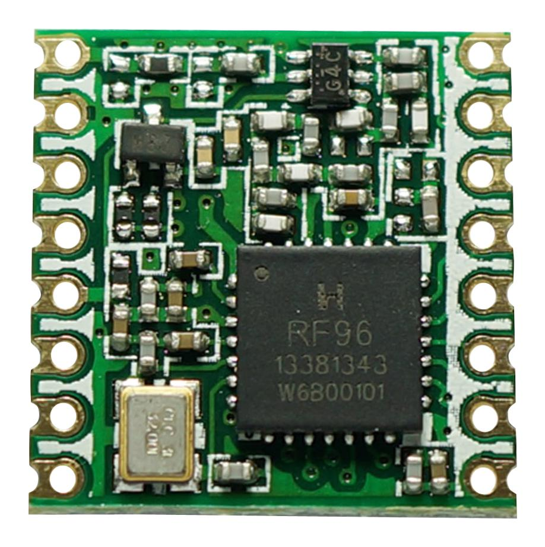
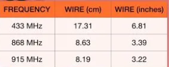
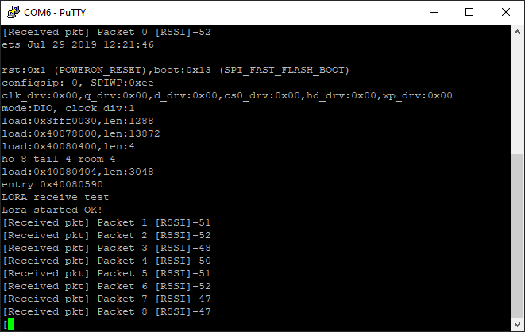
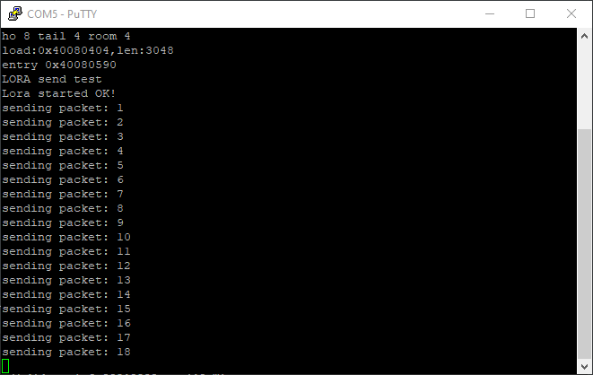
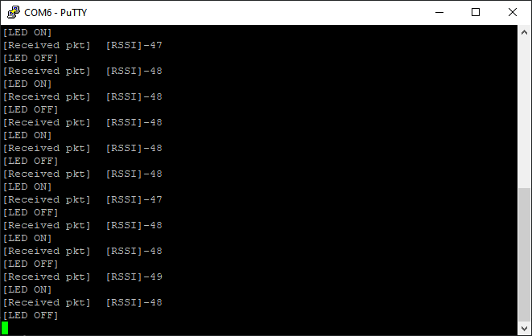

# LORA demonstration kit
LORA transmission tests codes 

This codes have been tested using ESP32WROOM dev board. They use VSPI for SPI and HOPE-RFM95W Lora
Modules pictured below. 
The connections are almost similar if using other LORA modules such as the Adafruit RFM9x modules.

## Needed libraries
1. Lora library by Sandeep Mistry (https://github.com/sandeepmistry/arduino-LoRa)

## Hardware setup
Connect the LORA modules to ESP32 as follows:

|LORA|ESP32|
|---|---|
|3V3|3V3|
|GND|GND|
|MOSI|23|
|MISO|19|
|SCK|18|
|NSS(CS)|4|
|RESET|2|
|DIO0|22|

These connections can be similar for the transmitter and the receiver.  
Note: NSS(CS) can be choosen to be any pin. The DIO0 pin is the IRQ pin that MUST be capable 
of hardware interrupt. On ESP32, any GPIO can be an interrupt pin

#### Frequency 
Use 868Mhz for Africa

#### Antenna
I used a single-core 30AWG wire antenna(am not sure that's the 
right one but it worked just fine) of 8cm as per the table of frequencies 
below.  
You can use the common whip antenna but rated for 868-928Mhz frequency.

## Tests done 
### 1. Simple packet send and receive
This tests very basic sending and receiving. The transmitter sends a packet with a message
count. 
The receiver parses the received packet and prints out on the serial monitor.
The screen shot below shows:
  
Sender  

  
Receiver  

  
### 2. Simple button and LED control
This tests how to control a remote LED using a button via LORA
We attach a button on the sending esp32, when we press the button, the LED
on the receive button gets turned ON
The results from the serial monitor are shown below:  
Sender  

  
Receiver  

### 3. Duplex communication

